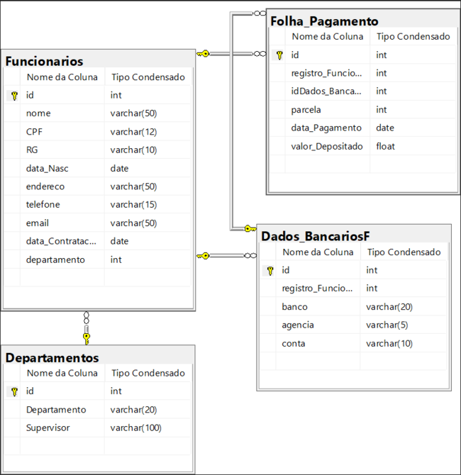
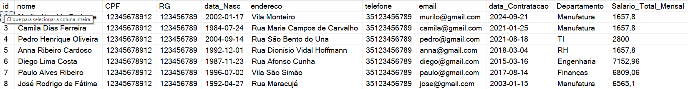
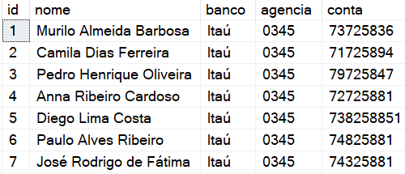
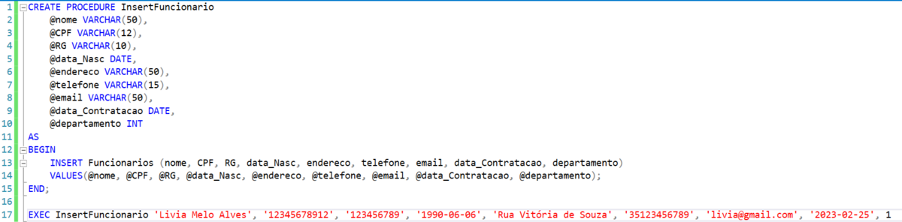

# RH - Folha de Pagamento

## Diagramas e Script
**Todo o script e documentação estão separados em pastas nesse mesmo repositório.**

## Explicação
Essa é uma estrutura de banco de dados em SQL sobre um sistema de **Folha de Pagamentos** em RH. O sistema conta com 4 tabelas, sendo ambas relacionadas entre si.

## Estrutura Banco de Dados - SQL
O sistema conta com 4 tabelas, sendo elas:
- **Departamentos**
  - Possui todos os departamentos de uma empresa.
- **Funcionarios**
  - Possui os cadastros e dados dos funcionários.
- **Dados_BancariosF**
  - Onde é cadastrado os dados bancários dos funcionários.
- **Folha_Pagamento**
  - Onde é registrado os pagamentos dos funcionários.

## Relacionamentos
Todas as tabelas possuem ***id*** como chaves primárias em **auto-increment**.  
- A tabela ***Funcionarios*** possui uma ***FK*** na coluna **departamento** que referencia a coluna **id** na tabela ***Departamentos***. 
- A tabela ***Dados_BancariosF*** possui uma ***FK*** na coluna **registro_Funcionario** que referencia a coluna **id** na tabela ***Funcionarios***.
- A tabela ***Folha_Pagamento*** possui uma ***FK*** na coluna **registro_Funcionario** que referencia a coluna **id** na tabela ***Funcionarios***. E também possui uma ***FK*** na coluna **idDados_Bancarios** que referencia a coluna **id** na tabela ***Dados_BancariosF***.

  
>Observação  
>A coluna **CPF** e **RG** não estão criptografadas nessa estrutura, pelo motivo de melhor visualização.

## View
O sistema possui duas view:
- **vwDadosFuncionarios** para trazer os dados dos funcionários na tabela ***Funcionarios***.  

- **vwFuncConta** para trazer os dados bancários dos funcionários.  

## Procedure
O sistema possui uma **Procedure** para cadastro de funcionários.  
  